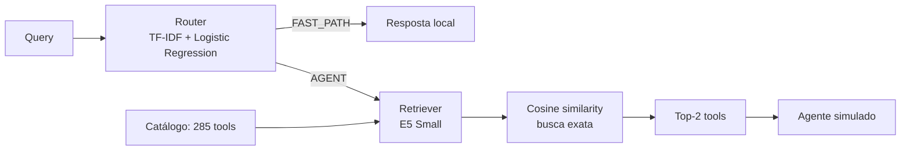

# Case Técnico — Router, Tool Retrieval e Harness de Avaliação

## Visão geral

Este projeto implementa três componentes de um agente de atendimento bancário fictício:

1. **Router**: classifica a query como `FAST_PATH` ou `AGENT`.
2. **Tool Retriever**: quando a rota é `AGENT`, recupera as duas tools mais relevantes entre 285 opções.
3. **Evaluation Harness**: compara as previsões com o ground truth e mede qualidade, custo e latência contra um baseline que sempre chama o LLM simulado.

## Arquitetura final



### Dados e responsabilidades

```text
router_training_data.json → treinamento supervisionado do Router
tools_registry.json       → catálogo indexado pelo Retriever
eval_dataset.json         → avaliação e comparação diagnóstica
```

O `eval_dataset.json` não foi usado para treinamento supervisionado do Retriever.

## Router

O Router final usa `TfidfVectorizer` com:

```python
TfidfVectorizer(
    lowercase=True,
    strip_accents="unicode",
    ngram_range=(1, 2),
    sublinear_tf=True,
    norm="l2",
)
```

Os unigramas e bigramas produzidos no `fit` alimentam uma `LogisticRegression(random_state=42, max_iter=1000)`. O mesmo vectorizer treinado transforma cada query no `predict`, que retorna rota, confiança e latência pelo contrato `RouteResult`.

Na avaliação fornecida, com 30 queries:

| Real \ Predito | FAST_PATH | AGENT |
|---|---:|---:|
| FAST_PATH | 10 | 0 |
| AGENT | 0 | 20 |

- Accuracy: **100% (30/30)**.
- Latência total observada: **48,2566 ms**.
- Latência média observada: aproximadamente **1,61 ms/query**.

A escolha foi comparada com MiniLM + Logistic Regression, que obteve 90% (27/30), dois falsos positivos `FAST_PATH → AGENT`, um falso negativo `AGENT → FAST_PATH` e aproximadamente 16,5 ms/query. O TF-IDF apresentou melhor resultado observado, menor latência e menor complexidade computacional.

O conjunto é pequeno e já foi observado durante o desenvolvimento. Portanto, 100% neste eval não garante generalização para novas formulações ou domínios.

## Tool Retriever

O Retriever é um bi-encoder baseado em `intfloat/multilingual-e5-small`, com vetores de 384 dimensões.

- Query: `query: {query}`.
- Tool: `passage: {tool_text}`.
- `tool_text`: nome legível + descrição + categoria.
- `normalize_embeddings=True`.
- Ranking por similaridade de cosseno.
- Busca exata em memória sobre as 285 tools.
- Retorno de `k=2` no fluxo principal.

Os embeddings das tools são calculados uma única vez no `fit`. Cada chamada a `search` codifica somente a query e reutiliza a matriz indexada do catálogo. Para esse tamanho de catálogo, busca exata é simples e evita a complexidade de um banco vetorial ou índice aproximado.

## Métricas do Retriever

A avaliação isolada usa as 20 queries com `expected_tool`:

| Métrica | Resultado |
|---|---:|
| Hit@1 | 20% (4/20) |
| Hit@2 | **45% (9/20)** |
| Hit@3 | 65% (13/20) |
| Hit@5 | **95% (19/20)** |
| Hit@10 | 95% (19/20) |
| MRR | 0,460595 |

Hit@2 de 9/20 significa que a `expected_tool` apareceu nas duas primeiras posições em 9 das 20 queries. Hit@5 de 19/20 significa que a `expected_tool` apareceu entre as cinco primeiras posições em 19 das 20 queries. Isso indica boa cobertura de candidatos, sem significar 95% de execução correta. O principal gargalo observado é o fine ranking entre tools semanticamente próximas.

O harness preserva o nome público `precision_at_k` exigido pelo case. Como existe uma única `expected_tool` por query e o cálculo verifica sua presença no Top-K, a métrica se comporta conceitualmente como **Hit Rate@K / Recall@K**. No pipeline final, todas as 20 queries de tool chegam ao Retriever e o resultado é `9/20 = 45%` para `k=2`.

### Ambiguidade entre tools

O catálogo possui operações semanticamente próximas, enquanto o eval fornece uma única `expected_tool` por query. Alguns exemplos:

- Para `Preciso saber o saldo disponível pra pix`, o Retriever prioriza `consultar_saldo_disponivel_pix`, enquanto o ground truth espera `consultar_saldo`.
- Para `Me envia a linha digitável da fatura`, existem tools específicas relacionadas à linha digitável, enquanto o ground truth espera `consultar_fatura`.
- Para `O aplicativo está travando, quero abrir um chamado`, existem operações específicas de suporte e travamento, enquanto o ground truth espera `abrir_chamado_suporte`.

Essas alternativas são semanticamente plausíveis, mas o ground truth fornecido pelo conjunto de avaliação espera uma tool específica. O schema disponível contém essencialmente `name`, `description` e `category`; não fornece relações ou sinais explícitos como `alias`, `specialization_of`, `parent_tool`, prioridade de negócio, `when_to_use` ou `when_not_to_use`. Assim, o modelo semântico não possui necessariamente informação suficiente para inferir uma preferência operacional que não esteja expressa nos textos.

## Experimentos e trade-offs

### Modelos dense do Retriever

| Estratégia | Hit@2 | Decisão |
|---|---:|---|
| MiniLM Dense | 20% | Baseline inicial |
| E5 Small Dense | **45%** | Escolhido pelo equilíbrio geral |
| E5 Base Dense | 50% | Uma query adicional, com latência e custo computacional substancialmente maiores no ambiente avaliado |

Com somente 20 queries, cada acerto representa cinco pontos percentuais. A diferença entre E5 Small e E5 Base foi de apenas uma query e, dado o tamanho reduzido do eval, não é evidência suficiente para concluir superioridade do Base.

Estratégias de reranking mais complexas também não justificaram integração. No diagnóstico final, o E5 Top-5 seguido de `cross-encoder/mmarco-mMiniLMv2-L12-H384-v1` produziu:

| Estratégia | Hit@1 | Hit@2 | MRR |
|---|---:|---:|---:|
| E5 Small Dense | 20% | 45% | 0,460595 |
| E5 Top-5 + Cross-Encoder | 10% | 35% | 0,395000 |

O Cross-Encoder zero-shot recuperou duas queries, causou quatro regressões, teve ganho líquido de menos duas queries e adicionou aproximadamente 100 ms por query. Por isso, não está no runtime. O resultado indica que adicionar um reranker sem supervisão específica do domínio não resolveu o problema; uma evolução futura só seria justificável com labels independentes do eval atual.

## Evaluation Harness

O harness executa o seguinte fluxo para cada query:

1. Router para todas as 30 queries.
2. Retriever apenas quando a rota prevista é `AGENT`.
3. Tool mock e Agent LLM simulado apenas para `AGENT`.
4. Baseline LLM simulado para todas as queries.
5. Cálculo de accuracy, matriz de confusão, `precision_at_k`, custo e latência.

Execução de referência da arquitetura final:

| Métrica | Resultado |
|---|---:|
| Router accuracy | 100% |
| Retriever `precision_at_k` | 45% (9/20), `k=2` |
| Smart cost | US$ 0,200035 |
| Baseline cost | US$ 0,900000 |
| Economia de custo | 77,7739% |
| Smart latency | 1.684,6607 ms |
| Baseline latency | 2.584,1511 ms |
| Economia de latência | 34,8080% |

Os custos são valores ilustrativos definidos em `common/mock_llm.py`, não preços reais de API. Os mocks de LLM possuem latência simulada variável, e hardware, cache e carga também afetam as medições. Os números acima representam uma execução de referência.

A latência do pipeline inteligente inclui Router, Retriever e Agent LLM simulado. O baseline mede sua chamada LLM completa. `fast_path_answer` e `mock_tool_execution` são operações locais instantâneas no mock. As latências representam o estado aquecido do serviço e não incluem download ou carregamento inicial do modelo nem a geração inicial dos embeddings do catálogo.

A métrica avalia a presença da `expected_tool` no Top-2, enquanto a simplificação de orquestração do mock executa apenas o primeiro resultado (`top_k_names[0]`). Assim, Hit@1 é 20% e Hit@2 é 45%; essa diferença deve ser considerada na interpretação end-to-end, sem ser tratada como bug do contrato.

## Como executar

Requisitos recomendados:

- Python 3.10 ou superior;
- dependências de `requirements.txt`;
- internet no primeiro download dos modelos ou cache local disponível.

```bash
python -m venv .venv
.venv\Scripts\activate
pip install -r requirements.txt
python -m pytest candidate_starter/tests -v
python -m candidate_starter.run_case
```

O relatório é gerado automaticamente em `reports/candidate_report.json`.

## Limitações metodológicas da avaliação

O eval possui 30 queries para o Router e 20 queries com `expected_tool` para o Retriever. Portanto, uma query representa aproximadamente 3,33 pontos percentuais no Router e cinco pontos percentuais no retrieval; diferenças pequenas entre modelos não devem ser superinterpretadas.

Há sobreposição literal e lexical entre parte dos exemplos fornecidos para treinamento e avaliação do Router. Por exemplo, `Quero saber meu saldo`, `Qual o valor da minha fatura desse mês?` e `Bom dia, qual o horário de atendimento?` aparecem literalmente tanto em `router_training_data.json` quanto em `eval_dataset.json`. Essa sobreposição pertence aos dados fornecidos, que foram preservados. O Router atingiu 100% no eval, mas o resultado representa aderência ao conjunto fornecido e não deve ser tratado como estimativa confiável de generalização — especialmente para um modelo lexical como TF-IDF.

O conjunto de avaliação também foi utilizado durante o desenvolvimento para comparação diagnóstica entre MiniLM, E5 Small, E5 Base e estratégias de reranking. Não houve treinamento direto do Retriever nessas queries, mas, após essas comparações, o conjunto não representa um holdout completamente cego. Os resultados devem ser interpretados considerando esse viés de seleção.

### Por que o Retriever não foi treinado no eval

O case fornece `router_training_data.json` para treinamento do Router, `tools_registry.json` como catálogo do Retriever e `eval_dataset.json` para avaliação. Não existe um conjunto supervisionado independente de `query → expected_tool` para treinamento do ranking.

Como as associações disponíveis de query e `expected_tool` pertencem ao eval, elas não foram usadas para treinar reranker, criar regras ou aliases, gerar exemplos sintéticos direcionados, ajustar pesos ou thresholds, criar priors por tool ou favorecer tools específicas observando os erros. Usar essas labels para ajustar o modelo e depois reportar desempenho no mesmo conjunto contaminaria a avaliação. O eval foi usado para medir e comparar alternativas de forma diagnóstica, não para treinamento supervisionado do Retriever.

Outras limitações são a existência de apenas uma `expected_tool` por query, a sobreposição semântica do catálogo e a ausência de metadados que expressem relações ou preferências operacionais. Hit@5 alto e Hit@2 menor indicam dificuldade de ordenação fina, não 95% de execução correta.

## Possíveis melhorias

Para melhorar a ordenação entre tools semanticamente próximas sem ajustar a solução ao conjunto de avaliação atual, seria necessário um dataset independente de `query → tool esperada`, dividido previamente em treino, validação e teste cego. Com esse sinal, seria possível treinar um reranker supervisionado sobre os candidatos do E5 Small e usar exemplos próximos como hard negatives.

Outra possibilidade seria enriquecer oficialmente o catálogo com informações como condições de uso, entradas, saídas, efeitos colaterais e relações de especialização entre tools. Essas melhorias dependem de dados e definições de domínio que não são fornecidos pelo case e, por isso, não fazem parte da implementação entregue.
